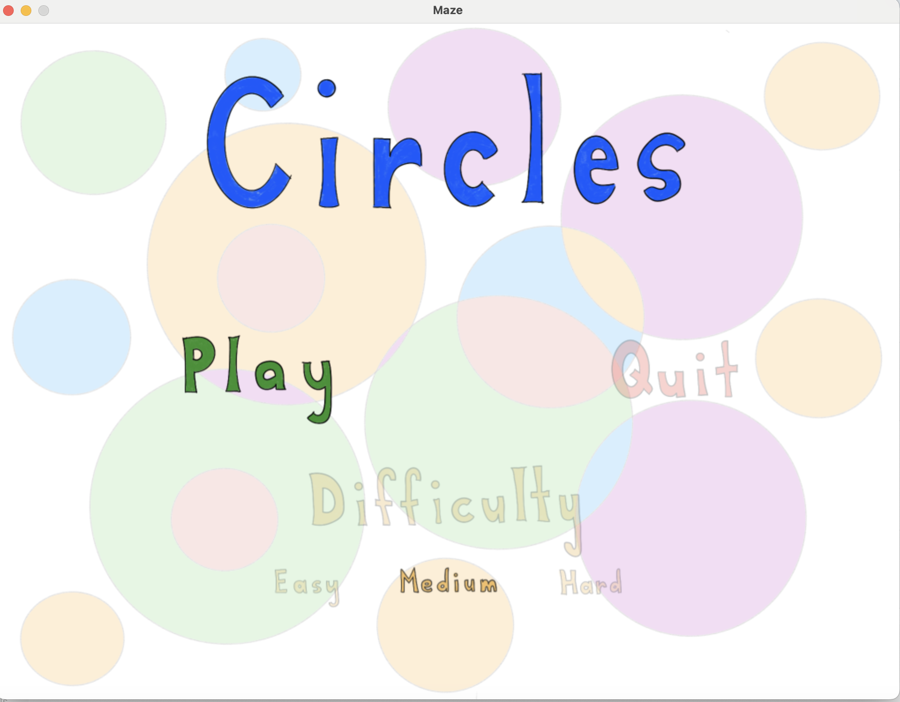
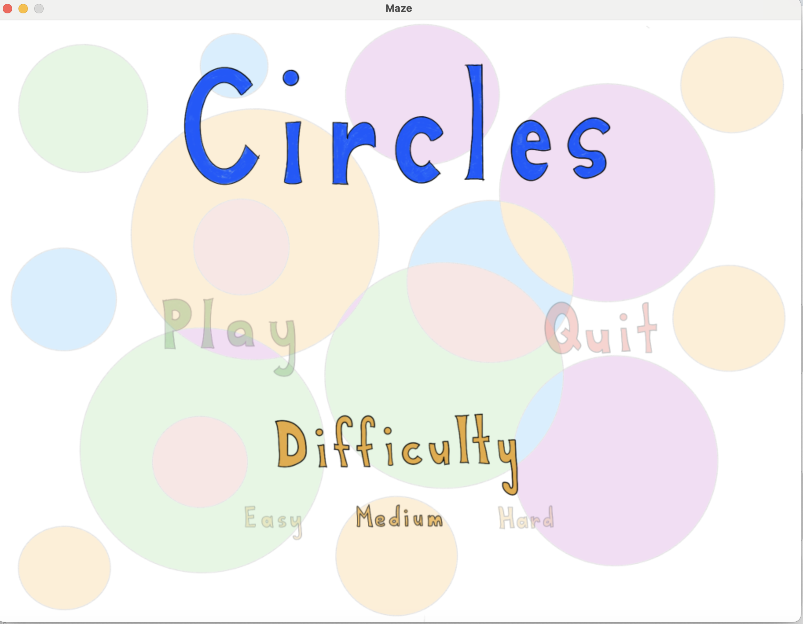
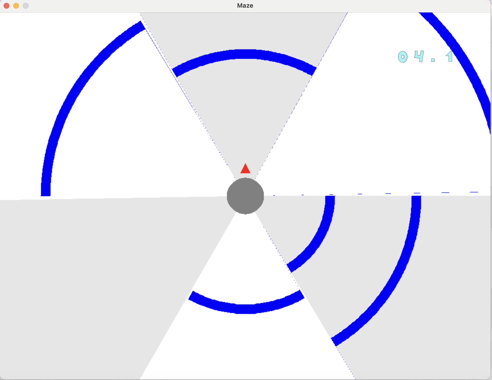
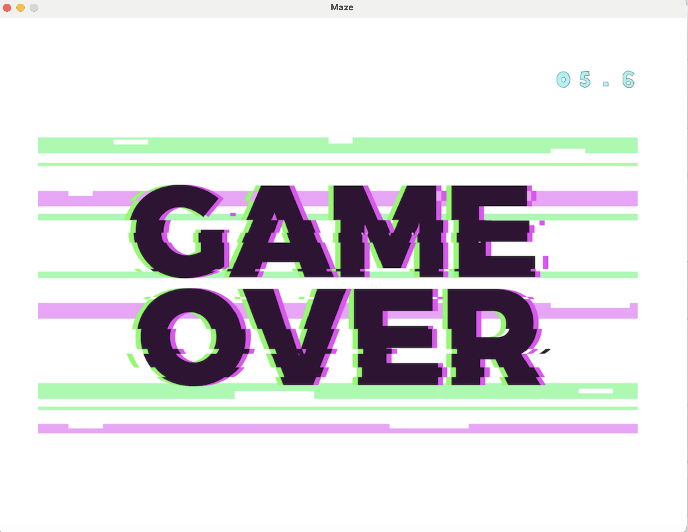

# Travail pratique 3 : Le jeu *Circles*

## Description

#### INF3135, UQAM, AUT2024
* Jeu Inspiré de Super Hexagon

Ce projet pour le cours **INF 3135** est un jeu vidéo inspiré de *Super Hexagon* de Terry Cavanagh. Le joueur contrôle une flèche rouge qui tourne autour d’un centre, tout en évitant des obstacles qui apparaissent de manière aléatoire. L’objectif principal est de survivre le plus longtemps possible en esquivant ces obstacles.

Le jeu propose trois niveaux de difficulté : **Easy**, **Normal**, et **Hard**, chacun augmentant la vitesse des obstacles. Avec une esthétique minimaliste et un gameplay addictif, ce projet met en valeur des concepts clés en programmation tels que la gestion des événements, les animations graphiques, et l’intégration audio pour une expérience immersive.

## Auteurs

- Olivier Généreux-Vincent (GENO22058208)
- Kaikou Loic Degni (DEGK24059500)

## Dépendances

Avant de pouvoir exécuter le projet, il est nécessaire d'installer plusieurs dépendances logicielles et bibliothèques. Ces dépendances sont essentielles au bon fonctionnement du jeu.

##### Logiciels

- **Compilateur GCC**  
  Le projet nécessite un compilateur C pour compiler le code source. Vous pouvez utiliser GCC ou Clang. Ces compilateurs sont généralement installés par défaut sur les systèmes Unix, Ubuntu et macOS avec Xcode.  
  - [Site officiel de GCC](https://gcc.gnu.org/)

#### Bibliothèques

- **SDL2 (Simple DirectMedia Layer 2)**  
  SDL2 est utilisé pour la gestion des graphiques, des entrées utilisateur et de l'audio.  
  [Site officiel de SDL2](https://www.libsdl.org/)

- **SDL2_mixer**  
  Cette bibliothèque permet de gérer les effets sonores et la musique dans le jeu. Elle s’appuie sur SDL2 pour fournir des fonctionnalités audio avancées.  
  [Site officiel de SDL2_mixer](https://www.libsdl.org/projects/SDL_mixer/)

- **SDL2_image**  
  SDL2_image est utilisé pour charger et afficher des images dans différents formats (PNG, JPEG, etc.).  
  [Site officiel de SDL2_image](https://www.libsdl.org/projects/SDL_image/)

- **SDL2_gfx**  
  Cette bibliothèque est utilisée pour dessiner des formes géométriques, des lignes, et gérer des effets graphiques simples.  
  [Site officiel de SDL2_gfx](https://www.ferzkopp.net/Software/SDL_gfx/)

## Fonctionnement

* Pour compiler, allez dans le dossier /src.  Par la suite, faire la commande 'make'.
  Pour partir le jeux, faire la commande './circle'
* Quel est sont but?
* Les flèches servent à naviguer dans le menu et la touche 'Enter' permet de faire les choix.
* Le jeu debute sur la page du menu
* 
* Vous pouvez faire un choix parmis les trois niveaux de difficultes
* 
* Apres avoir cliquer sur play, le jeu debute. Vous avez le chronometre en haut a droite de l'ecran
* 
* Pour déplacer le joueur durant la partie, appuyer sur les flèches GAUCHE et DROITE.
* Si vous toucher un obstacle, vous arrivez a l'ecran de fin. Il suffit de cliquer sur la touche return pour revenir au menu principal
* 

## Plateformes supportées

* MacOS M2
* Ubuntu

## Références

Citez vos sources ici, s'il y a lieu.

## Division des tâches

Donnez ici une liste des tâches de chacun des membres de l'équipe. Utilisez la
syntaxe suivante (les crochets vides indiquent que la tâche n'est pas
complétée, les crochets avec un `X` indique que la tâche est complétée):

* [X] Gestion du menu (Olivier)
* [X] Affichage de la scène (Olivier, Loic)
* [X] Affichage du chronomètre (Loic)
* [X] Animation des murs (Loic, Olivier)
* [X] Animation du joueur (Olivier)
* [X] Détection des collisions (Olivier, Loic)
* [X] Affichage d'une partie terminée (Loic)
* [X] Gestion de la musique principale (Olivier)
* [ ] Gestion des sons lorsqu'on navigue dans le menu
* [ ] Gestion de la musique de fin de partie

## État du projet

Le programme marche sans bogue du début à la fin.  Plusieurs parties peuvent être effectuer une à la suite de l'autre.
